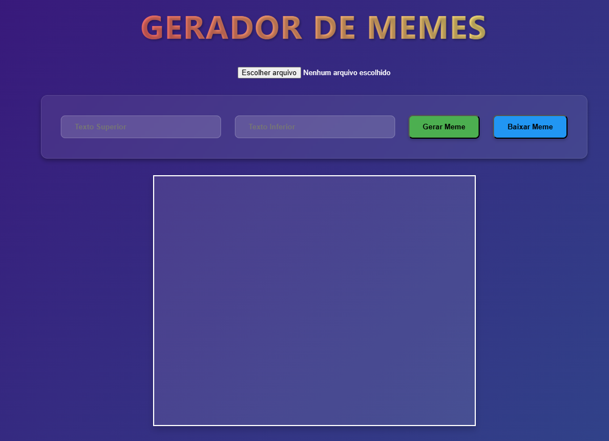

# 📸 GERADOR DE MEMES

Bem-vindo ao **Gerador de Memes**, um projeto desenvolvido em **HTML, CSS e JavaScript** que permite criar memes de forma simples e intuitiva. Faça o upload de uma imagem, adicione textos personalizados na parte superior e inferior, e gere seu meme instantaneamente!

---

## 🚀 Funcionalidades

- ✅ Upload de imagens para criação do meme
- ✅ Inserção de texto na parte superior e inferior
- ✅ Visualização em tempo real da edição do meme
- ✅ Download da imagem gerada com os textos aplicados
- ✅ Interface intuitiva e responsiva

---

## 🎥 Demonstração

### 🖼 Tela Inicial



### 📝 Inserção de Texto

Após selecionar uma imagem, basta digitar os textos que aparecerão na parte superior e inferior:


### 🖼 Meme Finalizado

Com a imagem e os textos aplicados, seu meme estará pronto para download:


---

## 🛠️ Tecnologias Utilizadas

- **HTML5** → Estrutura da página
- **CSS3** → Estilização e layout responsivo
- **JavaScript** → Manipulação da imagem e textos

---

## 📥 Como Utilizar

1. Clone este repositório:
   ```sh
   git clone https://github.com/seu-usuario/meme-generator.git
   ```
2. Acesse a pasta do projeto:
   ```sh
   cd gerador_memes
   ```
3. Abra o arquivo `index.html` em um navegador.

---

## 📌 Melhorias Futuras

- 📌 Adicionar mais opções de personalização (cor, fonte, tamanho do texto)
- 📌 Permitir salvar memes diretamente nas redes sociais
- 📌 Criar um banco de imagens populares para facilitar a criação

---

## 🤝 Contribuindo

Contribuições são bem-vindas! Siga os passos abaixo para colaborar:

1. Faça um fork do repositório
2. Crie uma branch para sua feature:
   ```sh
   git checkout -b minha-feature
   ```
3. Commit suas alterações:
   ```sh
   git commit -m 'Adicionando nova feature'
   ```
4. Faça um push para a branch:
   ```sh
   git push origin minha-feature
   ```
5. Abra um Pull Request

---

## 🏆 Autor

👤 **CEZAR DE SOUSA TOSTA**
- GitHub: [@Cezar-Tosta](https://github.com/Cezar-Tosta)
- LinkedIn: [Cezar Tosta](https://www.linkedin.com/in/cezar-tosta-b906b3125/)

---

## 📝 Licença

Este projeto está sob a licença MIT. Veja o arquivo **LICENSE** para mais detalhes.

---

